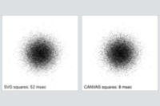

# SVG versus CANVAS Performance

Scatter plots have been used to display up to 1,000,000 data points (for example, [here](https://www.highcharts.com/demo/android/scatter-boost) and [here](https://blog.scottlogic.com/2020/05/01/rendering-one-million-points-with-d3.html)).  

The SVG element cannot support such large data sets.  The performance difference between SVG and CANVAS becomes critical during user interactions such as brushing.

[This project compares scatter plot rendering performance in SVG and CANVAS elements.](https://hemanrobinson.github.io/svg-canvas-performance/)

